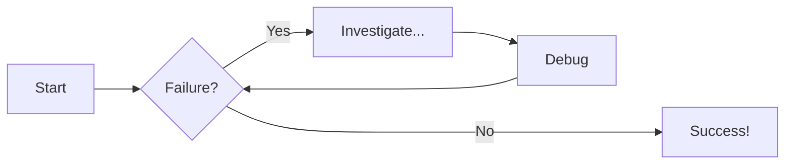

### Tabs

=== "1st part"

    ```yaml linenums="1" hl_lines="10-14"
    site_name: My Docs
    site_url: http://mkdocs.nedevski.com
    theme:
      name: material
      icon:
        logo: fontawesome/solid/blog
      palette:
        - scheme: slate
          toggle:
            icon: material/weather-sunny
            name: Dark mode
          primary: green
          accent: deep purple
        - scheme: default
          toggle:
            icon: material/weather-night
            name: Light mode
          primary: green
          accent: deep purple
    ```

=== "2nd part"

    ```yaml linenums="25" hl_lines="3-5"
    markdown_extensions:
      - attr_list
      - pymdownx.emoji:
          emoji_index: !!python/name:material.extensions.emoji.twemoji
          emoji_generator: !!python/name:material.extensions.emoji.to_svg
      - pymdownx.highlight:
          anchor_linenums: true
          line_spans: __span
          pygments_lang_class: true
      - pymdownx.inlinehilite
      - pymdownx.snippets
      - pymdownx.superfences
    ```


## Flowcharts




## Collapsible thing

??? info "Collapsible callout"

    Lorem ipsum dolor sit amet, consectetur adipiscing elit. Nulla et euismod
    nulla. Curabitur feugiat, tortor non consequat finibus, justo purus auctor
    massa, nec semper lorem quam in massa.

## Grid cards

<div class="grid cards" markdown>

-   :material-clock-fast:{ .lg .middle } __Set up in 5 minutes__

    ---

    Install [`mkdocs-material`](#) with [`pip`](#) and get up
    and running in minutes

    [:octicons-arrow-right-24: Getting started](#)

-   :fontawesome-brands-markdown:{ .lg .middle } __It's just Markdown__

    ---

    Focus on your content and generate a responsive and searchable static site

    [:octicons-arrow-right-24: Reference](#)

-   :material-format-font:{ .lg .middle } __Made to measure__

    ---

    Change the colors, fonts, language, icons, logo and more with a few lines

    [:octicons-arrow-right-24: Customization](#)

-   :material-scale-balance:{ .lg .middle } __Open Source, MIT__

    ---

    Material for MkDocs is licensed under MIT and available on [GitHub]

    [:octicons-arrow-right-24: License](#)

</div>


## Checklist

- [x] Lorem ipsum dolor sit amet, consectetur adipiscing elit
- [ ] Vestibulum convallis sit amet nisi a tincidunt
    * [x] In hac habitasse platea dictumst
    * [x] In scelerisque nibh non dolor mollis congue sed et metus
    * [ ] Praesent sed risus massa
- [ ] Aenean pretium efficitur erat, donec pharetra, ligula non scelerisque